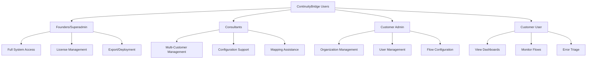

# 📚 ContinuityBridge User Guides

Welcome to ContinuityBridge documentation! Choose the guide that matches your role.

## 👥 User Roles

## 📖 Available Guides

### [🔧 Founder & Superadmin Guide](./founder-guide.md)
For system administrators and founders managing the entire platform.

**Topics Covered:**
- System configuration and monitoring
- License management and exports
- Customer creation and management
- Deployment orchestration
- Advanced security settings
- Performance tuning

---

### [👔 Consultant Guide](./consultant-guide.md)
For consultants managing multiple customer implementations.

**Topics Covered:**
- Multi-customer tenant selection
- Flow configuration best practices
- Interface adapter setup
- Data mapping and transformations
- Customer onboarding workflow
- Troubleshooting common issues

---

### [⚙️ Customer Admin Guide](./customer-admin-guide.md)
For customer administrators managing their organization.

**Topics Covered:**
- User management (add/remove users)
- Organization settings
- Branding and customization
- Flow management
- GDPR data requests
- Cluster configuration (if applicable)

---

### [📊 Customer User Guide](./customer-user-guide.md)
For end-users monitoring integrations and flows.

**Topics Covered:**
- Dashboard overview
- Monitoring flow executions
- Error triage dashboard
- Viewing logs and metrics
- Requesting data exports (GDPR)

---

## 🚀 Deployment Guides

### [📦 Self-Hosted Deployment](../deployment/self-hosted-deployment.md)
Deploy ContinuityBridge on your own infrastructure.

### [🌐 Cluster Deployment](../deployment/cluster-deployment.md)
Distributed deployment for high availability.

### [🔒 GDPR Compliance Setup](../deployment/gdpr-compliance.md)
Configure GDPR endpoints and compliance features.

---

## 🎓 Tutorials

### [Creating Your First Flow](../tutorials/creating-flows.md)
Step-by-step guide to building integration flows.

### [Setting Up Webhooks](../tutorials/webhooks-setup.md)
Configure webhook endpoints to receive data.

### [Data Mapping & Transformations](../tutorials/data-mapping.md)
Transform data between different formats.

---

## 🆘 Quick Help

### Common Tasks by Role

| Task | Founder | Consultant | Customer Admin | Customer User |
|------|---------|-----------|----------------|---------------|
| Create flows | ✅ | ✅ | ✅ | ❌ |
| Manage users | ✅ | ❌ | ✅ (own org) | ❌ |
| Export data (GDPR) | ✅ | ✅ | ✅ | ✅ |
| View dashboards | ✅ | ✅ | ✅ | ✅ |
| License management | ✅ | ❌ | ❌ | ❌ |
| Deploy packages | ✅ | ❌ | ❌ | ❌ |
| Cluster config | ✅ | ✅ | ✅ | ❌ |
| Interface setup | ✅ | ✅ | ✅ | ❌ |

---

## 🔗 Quick Links

- [Main README](../../README.md)
- [Production Checklist](../../PRODUCTION_CHECKLIST.md)
- [Deployment Guide](../../DEPLOYMENT.md)
- [GitHub Repository](https://github.com/Xhuk/ContinuityBridge.poc)

---

## 📞 Support

- **Email**: support@continuitybridge.com
- **GDPR/Privacy**: privacy@continuitybridge.com
- **Technical Support**: For self-hosted deployments, contact your consultant

---

**Last Updated**: November 2024  
**Version**: 1.0
