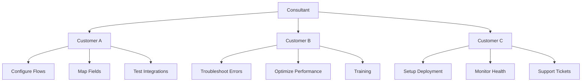
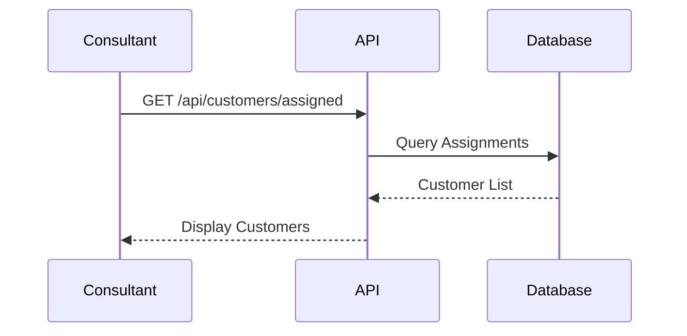
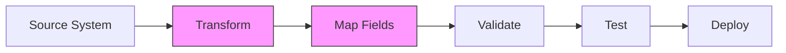
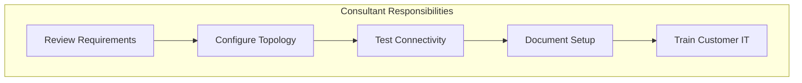
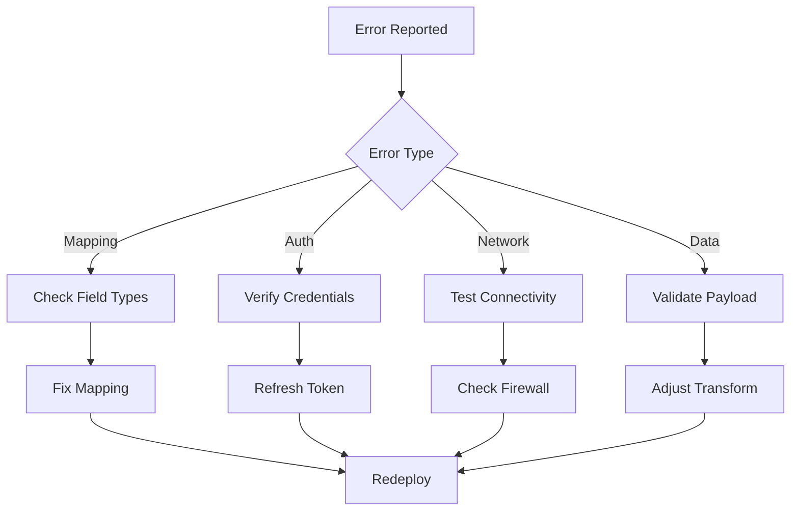
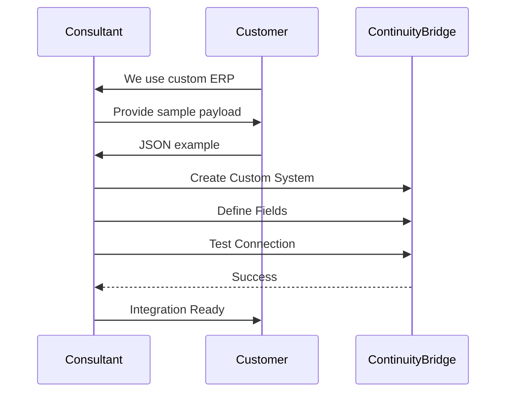
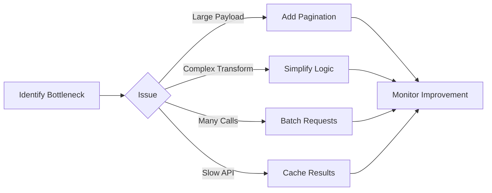
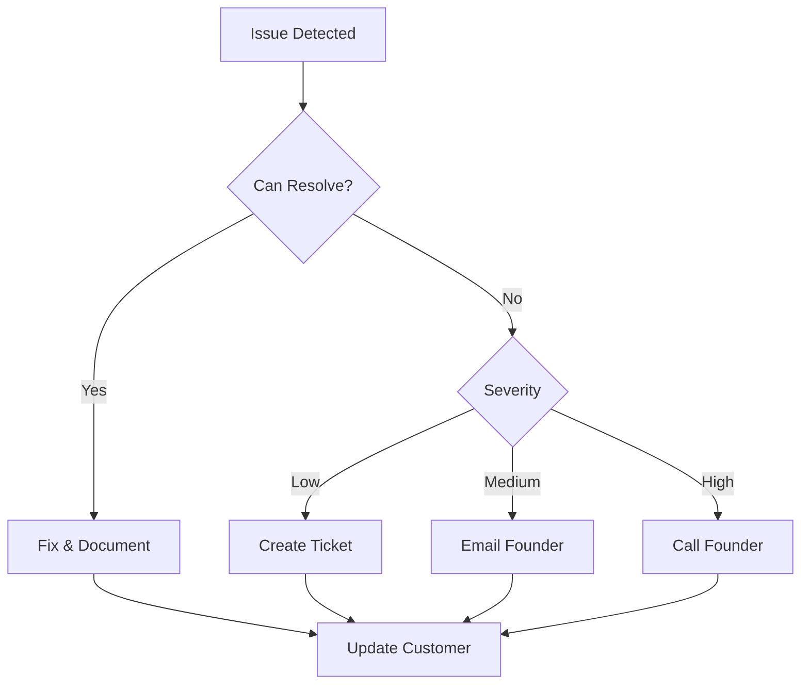
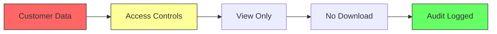

# 🤝 Consultant Guide

## Overview

As a Consultant, you assist multiple customer organizations with flow configuration, mapping, and deployment support. You act as the bridge between customers and the platform.

## Your Role



## Key Responsibilities

### 1. Customer Assignment

**View Your Assigned Customers:**



**Access:**
1. Login with consultant account
2. Navigate to **Dashboard**
3. View **"My Customers"** panel
4. Click on customer to access their workspace

---

### 2. Flow Configuration

**Help Customers Build Flows:**



**Configuration Steps:**

1. **Select Source System:**
   - Predefined: SAP, Salesforce, Shopify, etc.
   - Custom: Provide API details

2. **Configure Authentication:**
   ```
   API Key, OAuth 2.0, Basic Auth
   Store in Secrets Vault
   ```

3. **Map Fields:**
   - Source fields → Destination fields
   - Add transformations (uppercase, trim, concat)
   - Set default values

4. **Test Integration:**
   - Use sample data
   - Verify mappings
   - Check error handling

5. **Deploy to Production:**
   - Enable flow
   - Monitor first few executions
   - Alert customer when ready

---

### 3. Cluster Configuration Support

**For Enterprise Customers:**



**Configuration Access:**
1. Go to **Settings** → **Cluster Config** (customer workspace)
2. **Servers Tab:**
   - Work with customer IT to determine:
     - App Server IP/Port
     - DB Server IP/Port
     - Number of replicas
     - Resource limits
3. **Network Tab:**
   - Configure firewall rules
   - Enable SSL/TLS
   - Set up private network

4. **Instructions Tab:**
   - Copy deployment commands
   - Email to customer IT team
   - Schedule deployment call

---

### 4. Troubleshooting

**Common Issues:**



**Diagnostic Tools:**

1. **System Logs:**
   ```
   Settings → System Logs
   Filter by: Flow ID, Time Range, Error Level
   ```

2. **Flow Execution History:**
   ```
   Flows → [Flow Name] → Executions
   View: Status, Duration, Error Messages
   ```

3. **Test Payload:**
   ```
   Flows → [Flow Name] → Test
   Input: Sample JSON
   Output: Transformed JSON + Errors
   ```

---

## Advanced Features

### Custom System Integration

**When customer has custom/unknown system:**



**Steps:**
1. **Gather Information:**
   - System name
   - API endpoint
   - Authentication method
   - Sample payload (JSON/XML)

2. **Create Custom System:**
   ```
   Settings → Integrations → Add Custom System
   Name: Customer ERP
   Type: REST API
   Auth: API Key
   Sample Payload: [Paste JSON]
   ```

3. **Define Fields:**
   - Auto-detected from sample
   - Add comments for clarity
   - Mark required fields

4. **Test:**
   - Send test request
   - Verify response
   - Check error handling

---

### Performance Optimization

**If customer reports slow flows:**



**Optimization Checklist:**
- [ ] Enable caching for static data
- [ ] Use batch operations
- [ ] Add pagination for large datasets
- [ ] Optimize transformation logic
- [ ] Review retry policies
- [ ] Check network latency

---

## Customer Communication

### Weekly Status Updates

**Template:**
```markdown
## Weekly Update - [Customer Name]

### Completed This Week:
- ✅ Configured Salesforce → SAP flow
- ✅ Fixed mapping issue in Orders flow
- ✅ Deployed cluster configuration

### In Progress:
- 🔄 Testing Shopify integration
- 🔄 Optimizing Customer flow performance

### Next Week:
- 📅 Deploy Inventory sync flow
- 📅 Training session for customer team

### Issues/Blockers:
- ⚠️ Waiting for API credentials from customer IT

### Metrics:
- Flows Deployed: 3
- Success Rate: 99.2%
- Avg Response Time: 245ms
```

---

### Escalation Process

**When to Escalate:**



**Severity Levels:**
- **Low:** Non-critical, can wait 24-48h
- **Medium:** Impacts one flow, needs fix within 24h
- **High:** System down, multiple flows broken, customer escalated

**Escalation Contacts:**
- Technical Issues: support@continuitybridge.com
- Deployment Issues: founder@continuitybridge.com
- Customer Complaints: escalations@continuitybridge.com

---

## GDPR & Data Privacy

**As a Consultant:**



**Your Rights & Restrictions:**
- ✅ View customer flows and data for support
- ✅ Configure integrations on behalf of customer
- ❌ Download customer data
- ❌ Share customer info with other customers
- ⚠️ All access is logged and auditable

**GDPR Deletion:**
- You CAN request deletion of your own data
- Must transfer all customer assignments first
- 30-day notice required
- Founder approval needed

---

## Best Practices

### 1. Documentation
- Document all changes in customer workspace
- Add comments to complex mappings
- Update customer's flow diagram

### 2. Testing
- Always test in staging before production
- Use customer's sample data
- Verify error handling

### 3. Communication
- Set expectations early
- Provide regular updates
- Document decisions in tickets

### 4. Security
- Never share customer credentials
- Use Secrets Vault for API keys
- Log out when finished

---

## Common Tasks

### Add New Flow for Customer
```
1. Login to customer workspace
2. Flows → Create Flow
3. Configure source/destination
4. Map fields
5. Test with sample data
6. Deploy to staging
7. Customer approval
8. Deploy to production
```

### Fix Mapping Error
```
1. Flows → [Flow Name] → Edit
2. Review error in Executions tab
3. Adjust field mapping
4. Test transformation
5. Save changes
6. Monitor next execution
```

### Generate Customer Report
```
1. Dashboard → Customers → [Customer]
2. Reports → Flow Performance
3. Select date range
4. Export PDF
5. Email to customer admin
```

---

## Tips & Tricks

### Keyboard Shortcuts
- `Ctrl+K`: Quick search
- `Ctrl+S`: Save flow
- `Ctrl+T`: Test flow
- `Ctrl+D`: Deploy flow

### Bulk Operations
- Select multiple flows: `Shift+Click`
- Bulk enable/disable: Right-click menu
- Export multiple flows: Select → Export

### Debugging
- Use browser dev tools (F12)
- Check Network tab for API errors
- Review Console for JS errors
- Screenshot errors for escalation

---

## Need Help?

- **Technical Questions:** support@continuitybridge.com
- **Customer Issues:** escalations@continuitybridge.com
- **Billing/Licensing:** founder@continuitybridge.com

---

**Last Updated:** November 18, 2025
