# 👨‍💼 Customer Admin Guide

## Overview

As a Customer Admin, you manage your organization's ContinuityBridge workspace, including user management, flow configuration, and deployment settings.

## Dashboard Overview

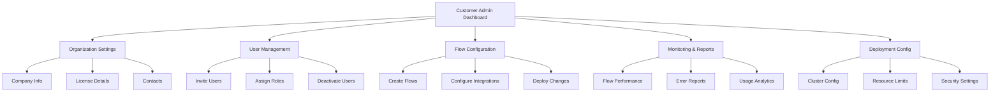

## Getting Started

### Initial Setup

**First Login Checklist:**

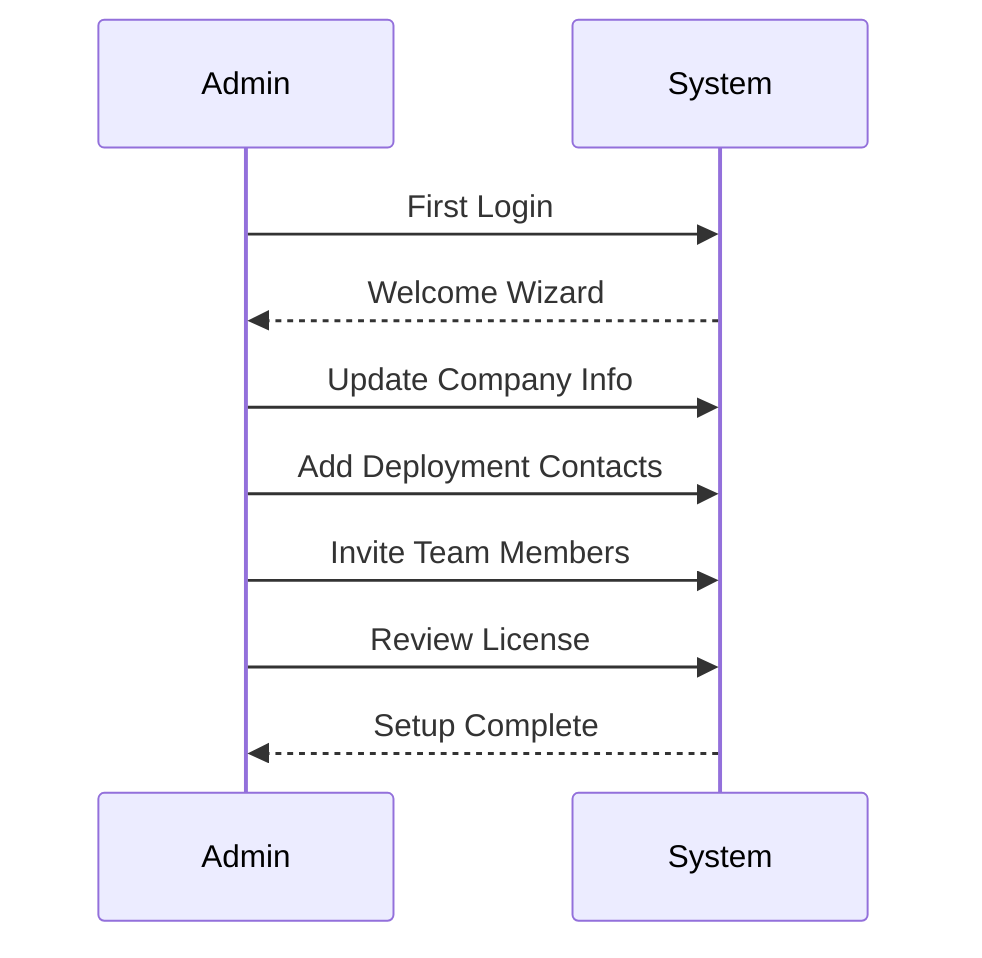

**Steps:**
1. ✅ Update organization profile
2. ✅ Add deployment contact email
3. ✅ Add technical contact email
4. ✅ Invite customer users
5. ✅ Review license limitations
6. ✅ Complete security checklist

---

## User Management

### Invite Team Members

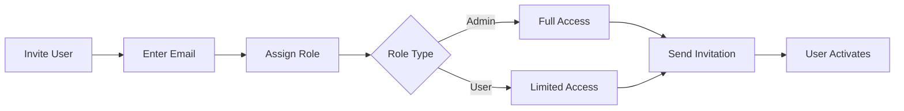

**To Invite:**
1. Go to **Settings** → **Users**
2. Click **"Invite User"**
3. Enter email address
4. Select role:
   - **Customer Admin:** Full organization access
   - **Customer User:** View and monitor only
5. Set permissions (optional):
   - Create flows
   - Edit flows
   - Delete flows
   - View reports
6. Click **"Send Invitation"**

**Email Template Sent:**
```
Subject: You've been invited to ContinuityBridge

[Your Name] has invited you to join [Company Name]'s 
ContinuityBridge workspace.

Role: Customer User
Access Level: View & Monitor

Click here to activate your account: [Link]

This link expires in 48 hours.
```

---

### Manage Existing Users

**User Actions:**

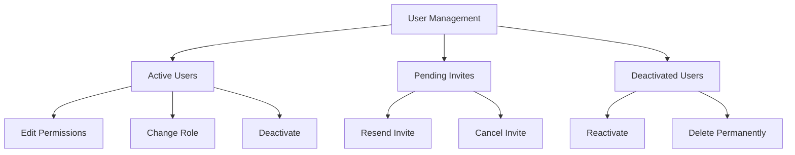

**Common Tasks:**

**Change User Role:**
```
Settings → Users → [User] → Edit
Change Role: Admin/User
Update Permissions
Save
```

**Deactivate User:**
```
Settings → Users → [User] → Deactivate
Reason: [Select reason]
Transfer Ownership: [If they own flows]
Confirm
```

**Reactivate User:**
```
Settings → Users → Deactivated → [User] → Reactivate
Confirm
```

---

## Flow Management

### Create Integration Flow

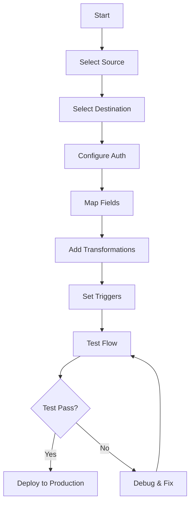

**Step-by-Step:**

**1. Create New Flow:**
```
Flows → Create Flow
Name: Salesforce to SAP Orders
Description: Sync new orders from Salesforce to SAP
```

**2. Configure Source (Salesforce):**
```
System Type: Predefined → Salesforce
Auth Method: OAuth 2.0
Click "Connect to Salesforce"
Authorize access
Select Object: Order
Trigger: On Create/Update
```

**3. Configure Destination (SAP):**
```
System Type: Predefined → SAP
Auth Method: API Key
API Key: [From Secrets Vault]
Endpoint: /api/orders
Method: POST
```

**4. Map Fields:**
```
Source Field          →  Destination Field
-----------------        -------------------
Order.Id             →  order_id
Order.CustomerName   →  customer_name
Order.Total          →  total_amount
Order.Items          →  line_items
```

**5. Add Transformations:**
```javascript
// Example transformation
{
  "customer_name": "{{ Order.CustomerName | uppercase }}",
  "total_amount": "{{ Order.Total | multiply(1.15) }}", // Add tax
  "order_date": "{{ Order.CreatedDate | date('YYYY-MM-DD') }}"
}
```

**6. Set Error Handling:**
```
On Error: Retry 3 times
Retry Delay: 5 seconds
Final Failure: Send email notification
Alert Email: admin@yourcompany.com
```

**7. Test:**
```
Click "Test Flow"
Use Sample Data or Real Record
Review Output
Check for Errors
```

**8. Deploy:**
```
Click "Deploy to Production"
Confirm
Monitor first 10 executions
```

---

### Monitor Flow Performance

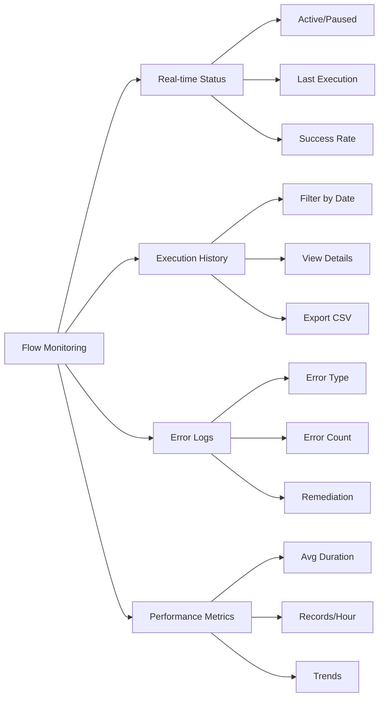

**Access Monitoring:**
```
Flows → [Flow Name] → Monitoring
```

**Key Metrics:**
- **Success Rate:** 99.5%
- **Avg Duration:** 245ms
- **Records Processed:** 1,250 today
- **Errors:** 2 (0.16%)
- **Status:** Active

**View Execution Details:**
```
Click on any execution
See: Input Data, Output Data, Errors, Duration
Download: JSON payload
```

---

## Organization Settings

### Company Information

```
Settings → Organization → Profile
```

**Editable Fields:**
- Organization Name
- Industry
- Company Size
- Website
- Address
- Phone
- Primary Contact

### Deployment Contacts

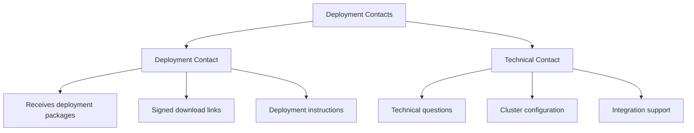

**Configure:**
```
Settings → Organization → Contacts

Deployment Contact:
  Name: John Doe
  Email: john.doe@yourcompany.com
  
Technical Contact:
  Name: Jane Smith
  Email: jane.smith@yourcompany.com
```

**When Are These Used?**
- ✅ Deployment packages are emailed to deployment contact
- ✅ Technical issues are sent to technical contact
- ✅ Cluster configuration instructions go to both

---

## Deployment Configuration

### Standard Deployment (Default)

**For most organizations:**

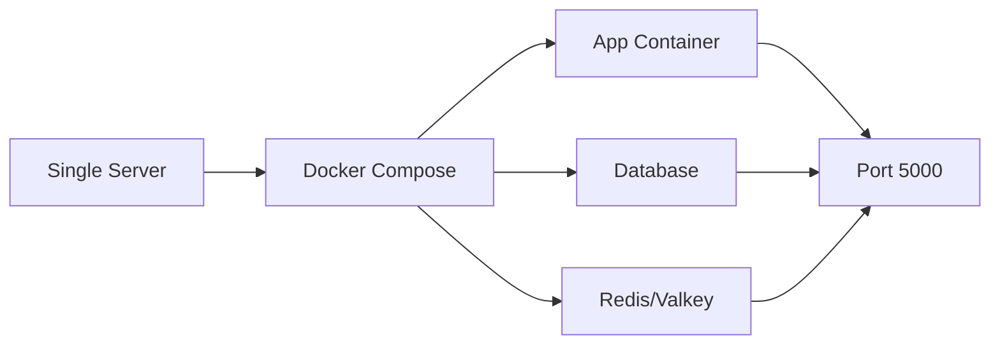

**No configuration needed** - works out of the box.

---

### Cluster Deployment (Enterprise)

**For high-availability, scalable deployments:**

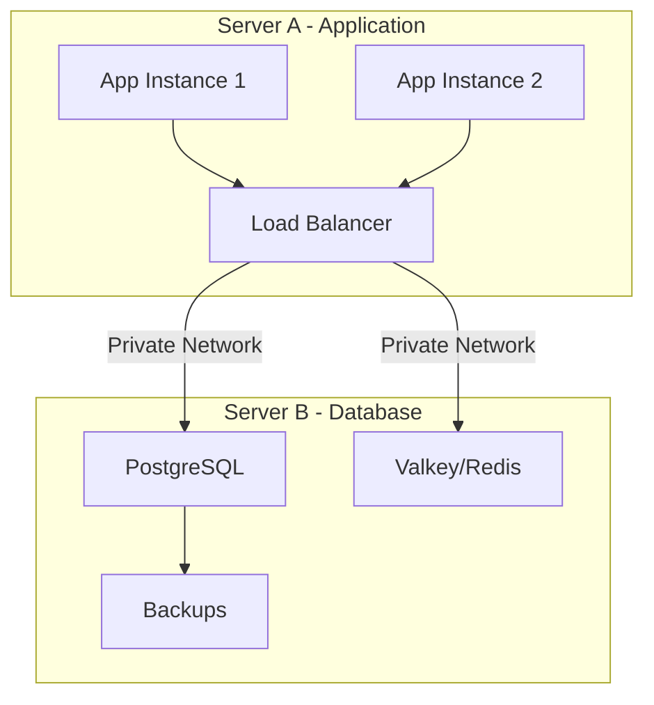

**Configuration Access:**

**Prerequisite:** Only available if you have **Cluster** deployment profile in your license.

**Steps:**
1. Go to **Settings** → **Cluster Config**
2. Click **"Enable Cluster Mode"**

**Tab 1: Servers**
```
App Server Configuration:
  Host: 10.0.1.10
  Port: 5000
  Replicas: 2
  CPU Limit: 2.0
  Memory Limit: 4GB

DB Server Configuration:
  Host: 10.0.1.20
  PostgreSQL Port: 5432
  Redis Port: 6379
  CPU Limit: 4.0
  Memory Limit: 8GB
```

**Tab 2: Network & Security**
```
Network:
  ✅ Private Network (Recommended)
  ✅ SSL/TLS Enabled
  
Firewall Rules:
  App Server: Allow 5000 from internet
  DB Server: Allow 5432,6379 from App Server only
  
Connectivity Test:
  [Test Connection Button]
```

**Tab 3: Setup Instructions**
```
Step-by-step deployment commands for your IT team:

Server A (Application):
  $ cd deployment-package
  $ chmod +x deploy-cluster.sh
  $ ./deploy-cluster.sh
  > Select: 1) App Server

Server B (Database):
  $ cd deployment-package
  $ chmod +x deploy-cluster.sh
  $ ./deploy-cluster.sh
  > Select: 2) DB Server
```

**Copy All Commands Button** - copies to clipboard

---

## Reports & Analytics

### Flow Performance Report

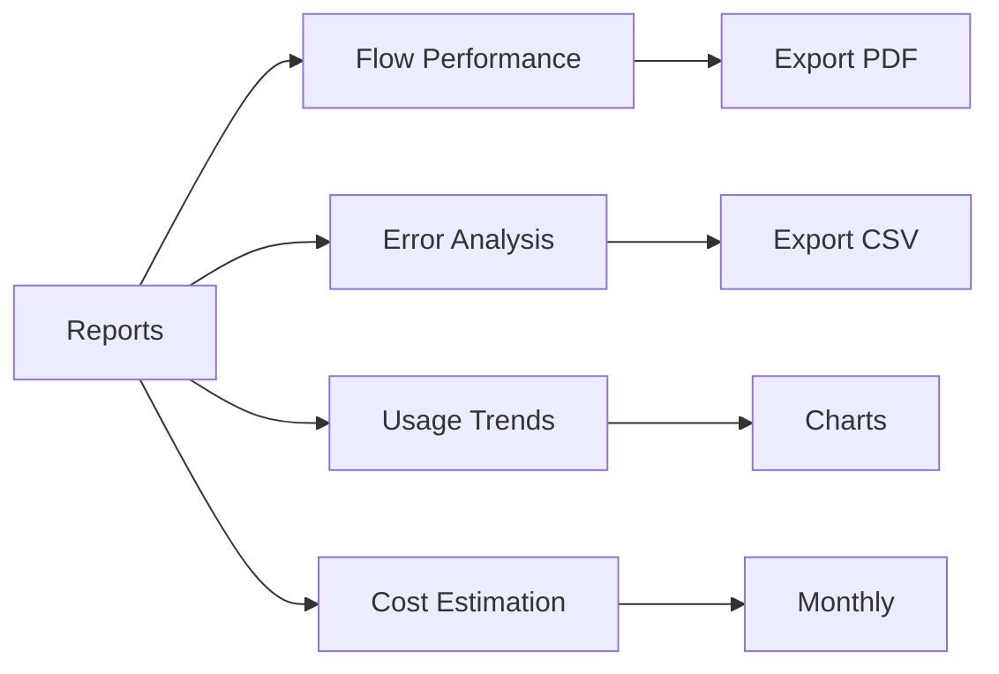

**Generate Report:**
```
Reports → Flow Performance
Date Range: Last 30 days
Flows: All (or select specific)
Format: PDF
Click "Generate Report"
```

**Report Includes:**
- Total executions
- Success/failure rate
- Average duration
- Peak usage hours
- Error breakdown
- Performance trends

---

## GDPR & Privacy

### Your Rights

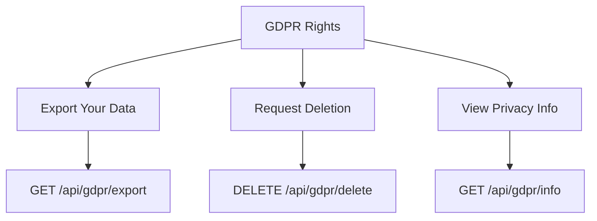

**Export All Your Data:**
```
Settings → Privacy → Export My Data
Format: JSON (portable)
Includes: Profile, Flows, Logs, Sessions
Download ZIP file
```

**Request Account Deletion:**

⚠️ **WARNING:** This action has specific rules for Customer Admins.

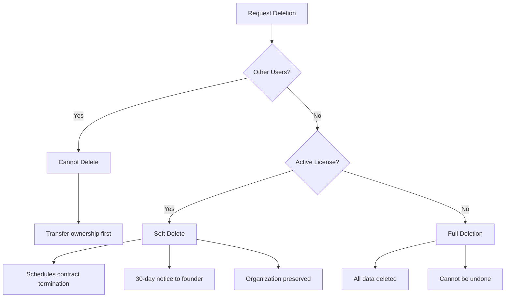

**For Customer Admins:**
- ❌ Cannot delete if you have active users → Transfer ownership first
- ⚠️ Deletion triggers contract termination (30-day window)
- ✅ Organization data preserved during notice period
- ✅ Can cancel deletion within 30 days

**For Regular Users:**
- ✅ Can request full deletion anytime
- ⚠️ Permanent and irreversible
- ✅ Confirmation token required

**To Request Deletion:**
```
Settings → Privacy → Delete My Account
Reason: [Select reason]
Confirmation Token: DELETE_MY_DATA_[your-user-id]
Type "DELETE" to confirm
Submit Request
```

---

## Troubleshooting

### Common Issues

**1. Flow Not Executing**

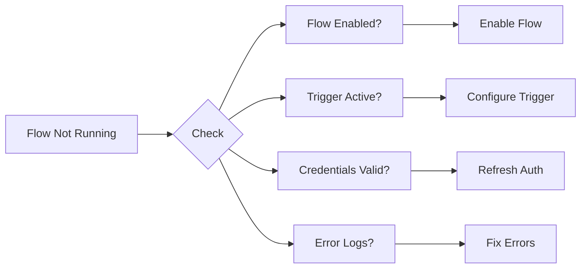

**Solution:**
```
1. Check flow status (Active/Paused)
2. Verify trigger configuration
3. Test authentication credentials
4. Review error logs
5. Contact support if persists
```

**2. Mapping Errors**

**Symptoms:**
- Field not found
- Type mismatch
- Null values

**Fix:**
```
Flows → [Flow] → Edit → Mappings
Review source field names (case-sensitive)
Check data types match
Add null checks
Test with sample data
```

**3. Performance Issues**

**If flow is slow:**
```
1. Check payload size (< 1MB recommended)
2. Enable pagination for large datasets
3. Optimize transformations
4. Review retry settings
5. Contact consultant for optimization
```

---

## Best Practices

### Security
- ✅ Use Secrets Vault for API keys
- ✅ Enable 2FA on your account
- ✅ Review user access quarterly
- ✅ Rotate credentials every 90 days

### Flow Design
- ✅ Use descriptive flow names
- ✅ Add comments to complex mappings
- ✅ Test thoroughly before production
- ✅ Set up error notifications

### Monitoring
- ✅ Check dashboard daily
- ✅ Review error logs weekly
- ✅ Generate monthly reports
- ✅ Monitor license usage

---

## Need Help?

**Your Support Contacts:**

```
Technical Questions:
  → Contact your assigned consultant
  → Email: [consultant-email]

Billing/License Questions:
  → Email: billing@continuitybridge.com

System Issues:
  → Email: support@continuitybridge.com

Emergency (System Down):
  → Call: [support-phone]
```

**Self-Service Resources:**
- User Guides: `/docs/user-guides`
- Video Tutorials: `/docs/tutorials`
- FAQ: `/docs/faq`
- API Docs: `/docs/api`

---

**Last Updated:** November 18, 2025
