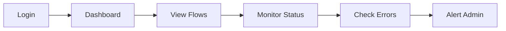
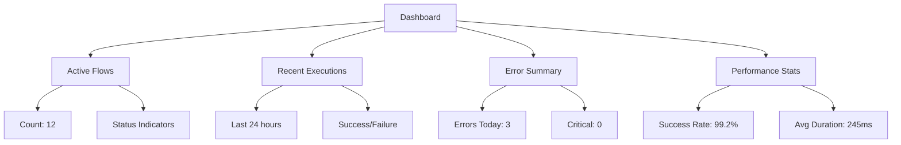
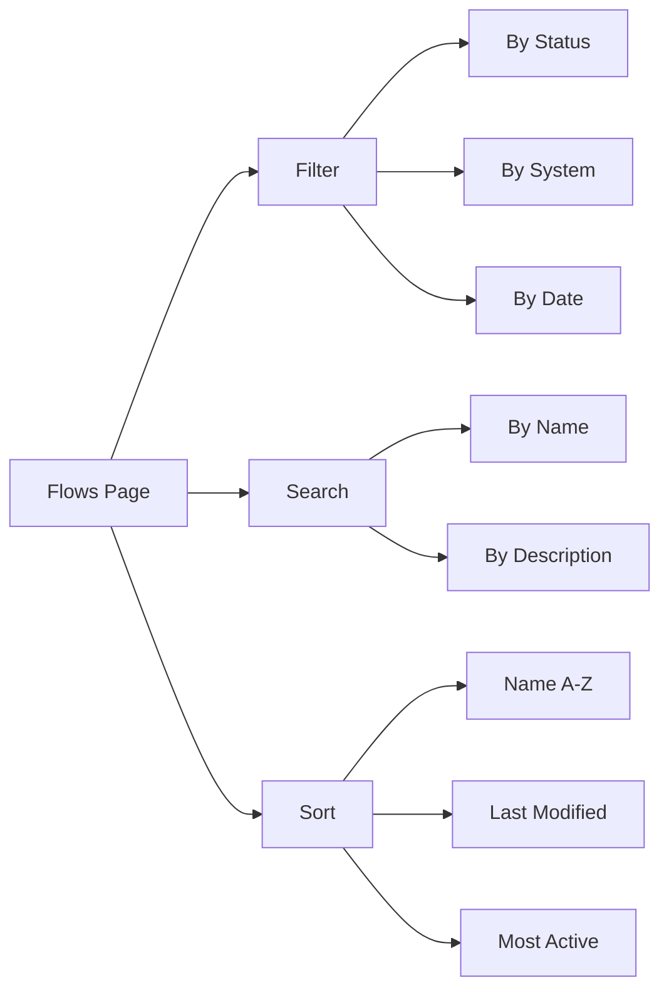
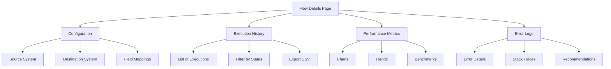
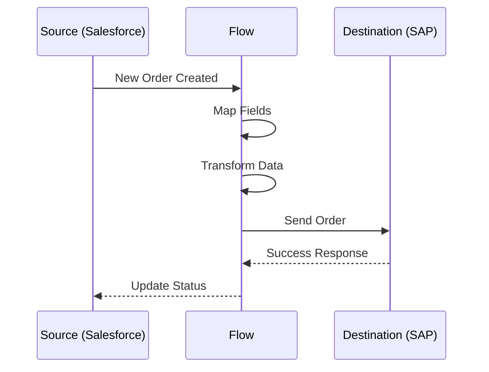
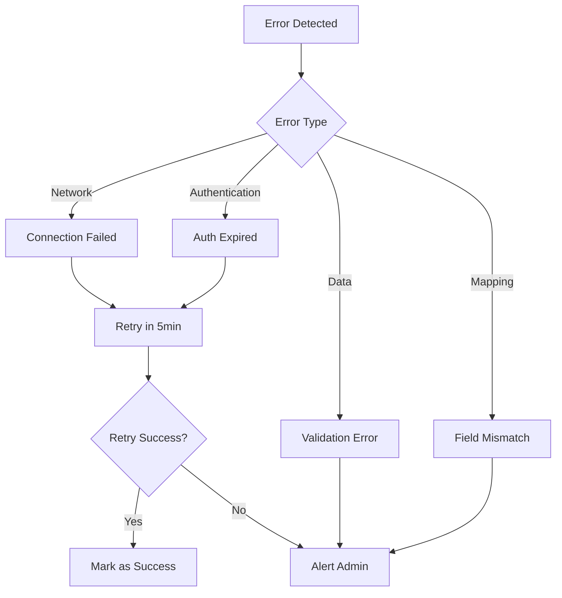
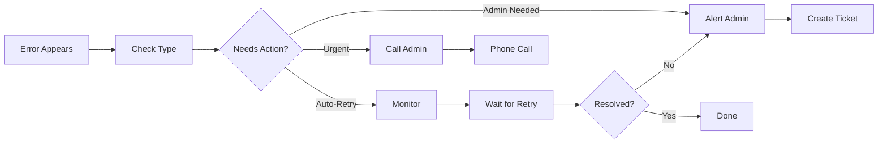
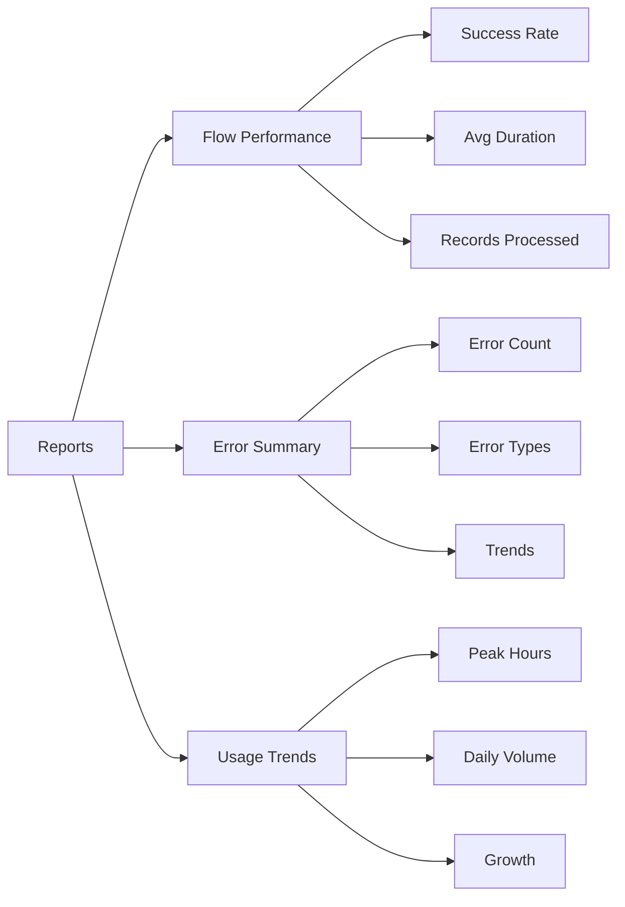
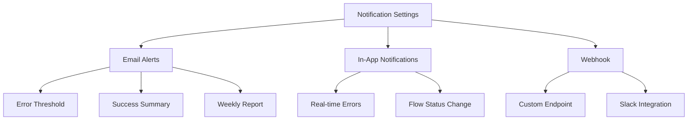

# 👤 Customer User Guide

## Overview

As a Customer User, you can view and monitor integration flows, check execution status, and triage errors in your organization's ContinuityBridge workspace.

## Quick Start



**Your Permissions:**
- ✅ View all flows
- ✅ Monitor execution status
- ✅ Check error logs
- ✅ View reports
- ❌ Create/edit flows (Admin only)
- ❌ Manage users (Admin only)
- ❌ Change settings (Admin only)

---

## Dashboard

### Overview Panel



**What You See:**

**Active Flows:**
```
Salesforce → SAP Orders        ✅ Active  (99.5% success)
Shopify → Inventory Sync       ✅ Active  (100% success)
SAP → QuickBooks Payments      ⚠️ Warning (95.2% success)
```

**Recent Activity:**
```
10:30 AM - Order #12345 synced successfully
10:28 AM - Payment #67890 failed (retry in 5min)
10:25 AM - Inventory updated (250 items)
```

**Alerts:**
```
⚠️ 3 errors in last hour
ℹ️ License expires in 45 days
✅ All systems operational
```

---

## Viewing Flows

### Flow List



**Access:**
```
Main Menu → Flows
```

**Flow Card Information:**
```
┌─────────────────────────────────────┐
│ Salesforce → SAP Orders             │
│ ✅ Active                            │
├─────────────────────────────────────┤
│ Last Run: 2 minutes ago             │
│ Success Rate: 99.5%                 │
│ Records Today: 125                  │
│ Avg Duration: 340ms                 │
├─────────────────────────────────────┤
│ [View Details] [View Executions]    │
└─────────────────────────────────────┘
```

**Filter Options:**
- **Status:** Active, Paused, Error, All
- **System:** Salesforce, SAP, Shopify, QuickBooks
- **Time:** Last 24h, Last 7 days, Last 30 days

---

### Flow Details



**View Configuration:**
```
Click on Flow → Configuration Tab

Source: Salesforce (Orders)
Destination: SAP (Sales Orders)

Field Mappings:
  OrderId → SalesOrder.Id
  CustomerName → SalesOrder.Customer
  Total → SalesOrder.NetAmount
  LineItems → SalesOrder.Items
  
Trigger: New Order Created
Schedule: Real-time
```

---

## Monitoring Executions

### Execution History



**View History:**
```
Flow Details → Executions Tab
```

**Execution Record:**
```
┌──────────────────────────────────────────────┐
│ Execution #45678                             │
│ ✅ Success                                    │
├──────────────────────────────────────────────┤
│ Started:  Nov 18, 2025 10:30:15 AM          │
│ Ended:    Nov 18, 2025 10:30:18 AM          │
│ Duration: 340ms                              │
│                                              │
│ Input Records:  1                            │
│ Output Records: 1                            │
│ Errors: 0                                    │
├──────────────────────────────────────────────┤
│ [View Input Data] [View Output Data]        │
└──────────────────────────────────────────────┘
```

**Status Types:**
- ✅ **Success:** Completed without errors
- ⚠️ **Warning:** Completed with minor issues
- ❌ **Failed:** Execution failed
- 🔄 **Retrying:** Will retry after delay
- ⏸️ **Paused:** Waiting for manual intervention

---

### View Execution Data

**Input Data Example:**
```json
{
  "OrderId": "ORD-12345",
  "CustomerName": "Acme Corp",
  "Total": 1250.00,
  "Currency": "USD",
  "LineItems": [
    {
      "Product": "Widget A",
      "Quantity": 10,
      "Price": 125.00
    }
  ]
}
```

**Output Data Example:**
```json
{
  "SalesOrderId": "SAP-67890",
  "Customer": "ACME CORP",
  "NetAmount": 1437.50,
  "Currency": "USD",
  "Items": [
    {
      "Material": "WIDGET-A",
      "Qty": 10,
      "Value": 143.75
    }
  ],
  "TaxAmount": 187.50
}
```

**Transformation Applied:**
- `CustomerName` → `UPPERCASE`
- `Total` → `Total * 1.15` (tax added)
- `Product` → Mapped to SAP material code

---

## Error Handling

### Understanding Errors



**Common Error Types:**

**1. Authentication Errors**
```
❌ Error: Invalid API credentials
Cause: API key expired or revoked
Action: Admin needs to refresh credentials
You Can: Alert admin via notification
```

**2. Mapping Errors**
```
❌ Error: Field 'CustomerEmail' not found
Cause: Source field name changed
Action: Admin needs to update mapping
You Can: Check if field exists in source system
```

**3. Network Errors**
```
❌ Error: Connection timeout to SAP server
Cause: Network issue or server down
Action: Usually auto-retries
You Can: Check if retry succeeded
```

**4. Validation Errors**
```
❌ Error: Invalid email format
Cause: Data doesn't meet destination requirements
Action: Admin may need to add validation
You Can: Identify problematic records
```

---

### Error Triage Process

**What You Should Do:**



**Step 1: Identify**
```
Flow Details → Executions → Filter: Failed
Click on failed execution
Read error message
```

**Step 2: Categorize**
- **Transient:** Network issues, timeouts → Auto-retry
- **Configuration:** Mapping errors, auth issues → Alert admin
- **Critical:** System down, data corruption → Call admin

**Step 3: Document**
```
Click "Report Issue"
Add screenshot
Describe what happened
Include error message
Submit to admin
```

**Step 4: Follow Up**
```
Check if error recurs
Monitor retry status
Confirm resolution
```

---

## Reports

### View Reports



**Access:**
```
Main Menu → Reports
```

**Flow Performance Report:**
```
┌────────────────────────────────────────┐
│ Last 30 Days Performance               │
├────────────────────────────────────────┤
│ Total Executions:    12,450            │
│ Successful:          12,375 (99.4%)    │
│ Failed:              75 (0.6%)         │
│                                        │
│ Avg Duration:        340ms             │
│ Peak Hour:           2:00 PM           │
│ Records Processed:   12,450            │
├────────────────────────────────────────┤
│ [Export PDF] [Export CSV]              │
└────────────────────────────────────────┘
```

**Charts Available:**
- Executions over time (line chart)
- Success vs. Failure (pie chart)
- Performance by flow (bar chart)
- Error distribution (bar chart)

---

## Notifications

### Configure Alerts



**Setup:**
```
Settings → Notifications → My Alerts

Email Alerts:
  ✅ Send email when error occurs
  ✅ Daily summary at 9:00 AM
  ✅ Weekly report on Monday
  
In-App Notifications:
  ✅ Flow status changes
  ✅ Errors requiring attention
  ❌ Every successful execution (too noisy)
  
Notification Email:
  your.email@company.com
```

---

## Best Practices

### Daily Checklist

**Morning (5 minutes):**
```
✅ Check dashboard for overnight errors
✅ Review success rate (should be > 95%)
✅ Check for any alerts
```

**Mid-Day (2 minutes):**
```
✅ Quick dashboard check
✅ Address any new errors
```

**End of Day (3 minutes):**
```
✅ Review daily summary
✅ Report persistent errors to admin
```

### When to Alert Admin

**Alert Admin If:**
- ✅ Error occurs more than 3 times
- ✅ Success rate drops below 95%
- ✅ Flow stops executing
- ✅ Authentication errors appear
- ✅ Data looks incorrect

**Don't Alert For:**
- ❌ Single transient error (auto-retries)
- ❌ Successful executions (noise)
- ❌ Minor warnings (< 1% impact)

### Keyboard Shortcuts

```
Ctrl+K    Quick search
Ctrl+R    Refresh dashboard
Ctrl+E    View errors
Ctrl+F    Filter flows
F5        Refresh current page
```

---

## GDPR & Privacy

### Your Rights

**Export Your Data:**
```
Settings → Privacy → Export My Data
Includes: Your profile, activity logs
Format: JSON (portable)
Download: ZIP file
```

**Request Account Deletion:**
```
Settings → Privacy → Delete My Account

⚠️ WARNING: This is permanent and irreversible.

Required:
  Confirmation token: DELETE_MY_DATA_[your-id]
  Type "DELETE" to confirm
  
Result:
  - All your data deleted
  - Cannot be recovered
  - Admin will be notified
```

---

## Troubleshooting

### Can't See a Flow

**Check:**
1. Flow exists and is not deleted
2. You have permission to view it
3. Flow is not archived

**Solution:**
```
Contact your admin to grant access
```

### Dashboard Not Loading

**Try:**
1. Refresh page (F5)
2. Clear browser cache
3. Try different browser
4. Check internet connection

**If persists:**
```
Email: support@continuitybridge.com
Include: Screenshot, browser version
```

### Email Notifications Not Received

**Check:**
1. Email address is correct in settings
2. Check spam/junk folder
3. Add sender to safe list

**Update Email:**
```
Settings → Profile → Email
Update email address
Verify new email
```

---

## Need Help?

**Contact Your Admin:**
```
Your organization's Customer Admin can help with:
- Access permissions
- Flow questions
- Configuration issues
- Account settings
```

**Contact Support:**
```
Technical Issues: support@continuitybridge.com
Account Questions: accounts@continuitybridge.com
```

**Self-Service:**
- User Guides: `/docs/user-guides`
- FAQ: `/docs/faq`
- Video Tutorials: `/docs/tutorials`

---

**Last Updated:** November 18, 2025
