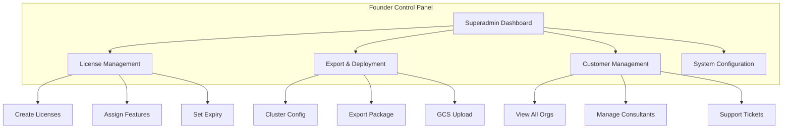
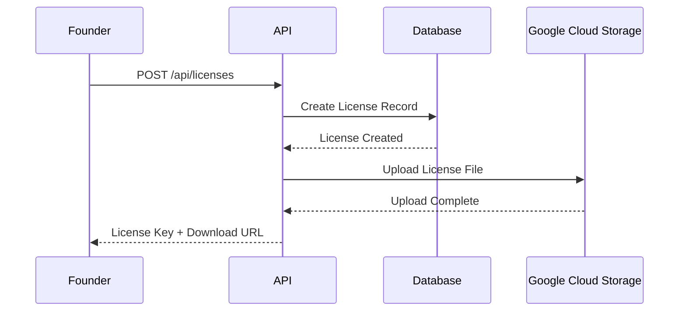
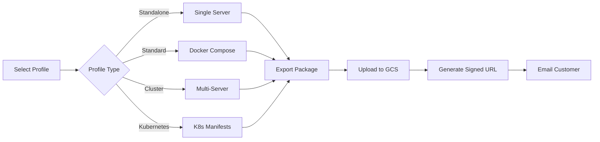
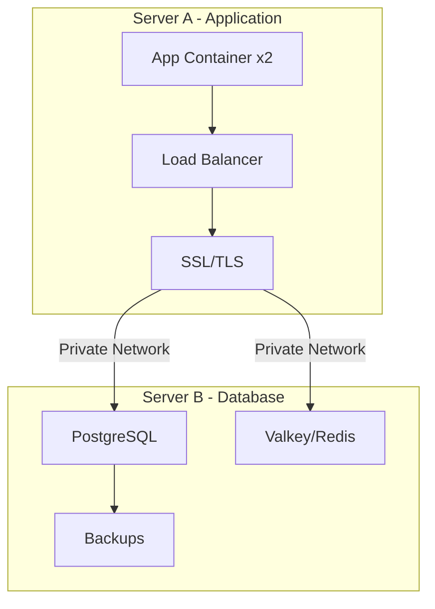
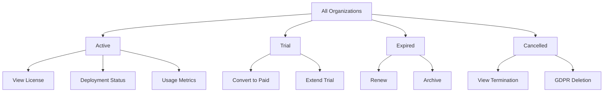
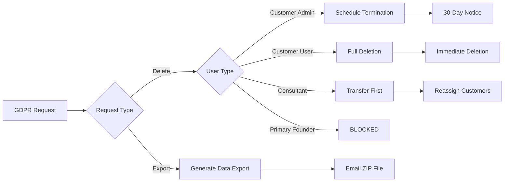

# 🔧 Founder & Superadmin Guide

## Overview

As a Founder or Superadmin, you have complete control over the ContinuityBridge platform, including license management, deployment configuration, and system-wide settings.

## System Architecture



## Key Responsibilities

### 1. License Management

**Create a New Customer License:**



**Steps:**
1. Navigate to **Settings** → **License Management**
2. Click **"Create New License"**
3. Fill in customer details:
   - Organization Name
   - License Type (trial/annual/perpetual)
   - Expiration Date
   - Deployment Contact Email
   - Technical Contact Email
4. Click **"Generate License"**
5. Download license file or send to customer

---

### 2. Deployment & Export

**Generate Deployment Package:**



**Deployment Profiles:**

| Profile | Use Case | Servers | Scalability |
|---------|----------|---------|-------------|
| **Standalone** | Development/Testing | 1 | Low |
| **Standard** | Small Business | 1 | Medium |
| **Cluster** | Enterprise | 2+ | High |
| **Kubernetes** | Large Scale | 3+ | Very High |

**To Generate:**
1. Go to **Settings** → **Export & Deployment**
2. Select customer organization
3. Choose deployment profile
4. Configure cluster settings (if applicable):
   - App Server Host/Port
   - DB Server Host/Port
   - Replica Count
   - Resource Limits
5. Click **"Generate Deployment Package"**
6. System will:
   - Create Docker images
   - Generate configuration files
   - Upload to Google Cloud Storage
   - Email customer with download link

---

### 3. Cluster Configuration

**For Enterprise Customers (Cluster Profile):**



**Configuration Steps:**
1. Navigate to **Settings** → **Cluster Config**
2. **Servers Tab:**
   - App Server: `10.0.1.10:5000`
   - DB Server: `10.0.1.20:5432`
   - Redis Server: `10.0.1.20:6379`
   - App Replicas: `2`
3. **Network & Security Tab:**
   - Enable Private Network
   - Enable SSL/TLS
   - Configure firewall rules
4. **Setup Instructions Tab:**
   - Copy deployment commands
   - Share with customer IT team

---

### 4. Customer Management

**View All Organizations:**



**Actions Available:**
- View organization details
- Check deployment status
- Review license information
- Access customer flows (read-only)
- Assign consultants
- Manage support tickets

---

## Advanced Features

### Google Cloud Storage Configuration

**Setup for Deployment Storage:**

1. **Create GCS Bucket:**
   ```bash
   Bucket Name: continuitybridge-deployments
   Location: us-central1
   Storage Class: Standard
   Access Control: Uniform
   ```

2. **Configure Environment Variables:**
   ```env
   GCP_PROJECT_ID=your-project-id
   GCS_DEPLOYMENT_BUCKET=continuitybridge-deployments
   GCP_SERVICE_ACCOUNT_KEY={"type":"service_account",...}
   ```

3. **Test Connection:**
   ```bash
   npm run test:gcs
   ```

---

### GDPR Compliance

**Founder GDPR Responsibilities:**



**Important Notes:**
- ✅ Consultants can request GDPR deletion
- ✅ Other superadmins can request deletion
- ❌ Primary Founder (you) cannot self-delete
- ⚠️ Customer admins trigger contract termination

**Primary Founder Protection:**
- Set `PRIMARY_FOUNDER_USER_ID` in `.env`
- This user ID is protected from deletion
- Can disable account or transfer ownership instead

---

## Security Best Practices

### 1. API Key Management
```env
SUPERADMIN_API_KEY=cb_prod_superadmin_CHANGE_THIS
```
⚠️ Change default keys in production

### 2. Encryption
```env
ENCRYPTION_KEY=generate-32-character-random-key
```
🔐 Use strong random keys

### 3. Database Backups
- Automatic daily backups enabled
- Retention: 30 days
- Manual backup: Settings → Backups

### 4. Access Logs
- All superadmin actions logged
- Review: Settings → System Logs
- Filter by action type

---

## Common Tasks

### Create Trial License
```
Settings → Licenses → New License
Type: Trial
Duration: 14 days
Features: All (limited)
```

### Convert Trial to Paid
```
Settings → Licenses → [Customer] → Upgrade
Select: Annual/Perpetual
Update expiry date
Save
```

### Assign Consultant to Customer
```
Settings → Customers → [Customer] → Consultants
Add Consultant: [Select from list]
Permissions: View/Edit/Deploy
Save
```

### Generate Deployment Report
```
Settings → Export → Reports
Select Customer
Date Range
Export Format: PDF/CSV
Download
```

---

## Troubleshooting

### Deployment Package Generation Fails

**Check:**
1. GCS credentials configured
2. Bucket exists and accessible
3. Sufficient GCP credits
4. Network connectivity

**Fix:**
```bash
# Test GCS connection
node -e "require('dotenv').config(); ..."

# Check logs
tail -f logs/export.log
```

### Customer Cannot Access Deployment

**Verify:**
1. License not expired
2. Download URL not expired (7 days)
3. Customer email correct
4. Firewall not blocking GCS

**Resolution:**
```
Settings → Licenses → [Customer] → Regenerate Download Link
```

---

## Need Help?

- **Technical Support:** support@continuitybridge.com
- **GDPR Questions:** privacy@continuitybridge.com
- **Emergency:** founder@continuitybridge.com

---

**Last Updated:** November 18, 2025
